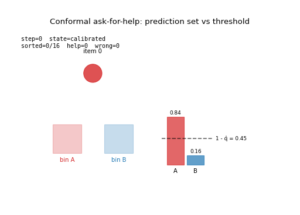
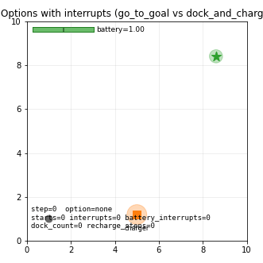
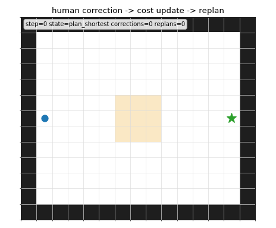
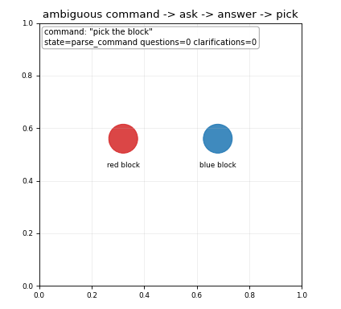

# PythonInteractiveRobotics

[](https://github.com/rsasaki0109/PythonInteractiveRobotics/actions/workflows/ci.yml)

[](LICENSE)


**Robots observe, act, fail, retry, update beliefs, and replan.**
This repo shows that loop in small, readable Python — no ROS, no GPU, no
simulator. Just `numpy + matplotlib`.

[Open the example gallery](https://rsasaki0109.github.io/PythonInteractiveRobotics/)
or jump straight into the first runnable loop below. You can also run the
flagship loops directly in Colab:
[pick and retry](https://colab.research.google.com/github/rsasaki0109/PythonInteractiveRobotics/blob/main/notebooks/pick_and_retry.ipynb),
[safety filter](https://colab.research.google.com/github/rsasaki0109/PythonInteractiveRobotics/blob/main/notebooks/safety_filter_cbf.ipynb), and
[human correction replanning](https://colab.research.google.com/github/rsasaki0109/PythonInteractiveRobotics/blob/main/notebooks/human_correction_replanning.ipynb).
For language ambiguity, try
[clarifying question](https://colab.research.google.com/github/rsasaki0109/PythonInteractiveRobotics/blob/main/notebooks/clarifying_question.ipynb).
If the project helps you teach, prototype, or explain robotics loops, a GitHub
star helps others find it.

| Avoiding | Reaching under occlusion | Mapping while uncertain |
| --- | --- | --- |
|  |  |  |

## Try it

```bash
git clone https://github.com/rsasaki0109/PythonInteractiveRobotics.git
cd PythonInteractiveRobotics
python3 -m pip install -e .
python3 examples/manipulation/01_pick_and_retry.py
```

A tiny tabletop robot misses a grasp, updates its belief, and retries — in
under 5 seconds. Core dependencies are `numpy` and `matplotlib` only.

For an even smaller first loop:

```bash
python3 examples/runtime/01_sense_act_loop.py
```

## Start Here

| If you want to see | Run | What it teaches |
| --- | --- | --- |
| Failure recovery | `python3 examples/manipulation/01_pick_and_retry.py` | grasp miss -> belief update -> retry |
| Runtime safety | `python3 examples/navigation/29_safety_filter_cbf.py` | nominal controller -> CBF projection -> safe motion |
| Active perception | `python3 examples/navigation/07_active_slam_toy.py` | map and pose uncertainty -> information-seeking action |
| Human correction | [Open in Colab](https://colab.research.google.com/github/rsasaki0109/PythonInteractiveRobotics/blob/main/notebooks/human_correction_replanning.ipynb) | shortcut -> human correction -> cost update -> replan |
| Language ambiguity | [Open in Colab](https://colab.research.google.com/github/rsasaki0109/PythonInteractiveRobotics/blob/main/notebooks/clarifying_question.ipynb) | ambiguous command -> ask question -> answer -> act |

## Status

38 runnable examples · 37 README GIFs · 107 smoke / regression tests ·
5 Gymnasium-style adapters · CI green on Python 3.10, 3.11, and 3.12.

See `docs/status.md` for the implementation snapshot, `docs/plan.md` for the
working execution plan, and `examples/README.md` for the complete example
index. The GitHub Pages gallery is generated from `docs/index.html`, and
`docs/public_launch.md` keeps the public launch checklist.

## Why this project?

Modern robotics is not just planning a path or running a controller once.
Robots observe, act, fail, retry, update beliefs, and replan in partially
observable environments. This repository teaches those loops with small,
readable, runnable Python examples.

## Design goals

Run in 5 seconds · minimal dependencies · no ROS / Docker / GPU / heavy
simulator required · notebook friendly · interactive · closed-loop ·
failure-aware · educational.

## Install

```bash
git clone https://github.com/rsasaki0109/PythonInteractiveRobotics.git
cd PythonInteractiveRobotics
python3 -m pip install -e .
```

For contributors and GIF regeneration: `python3 -m pip install -e ".[dev]"`.

## See The Loops

These GIFs are generated from the runnable examples, not separate animations.

### Runtime and first manipulation loop

| Sense-act loop | Pick and retry |
| --- | --- |
|  |  |

### Manipulation

| Reactive grasping | Closed-loop IK |
| --- | --- |
|  |  |

| Moving target reaching | Object search and pick |
| --- | --- |
|  |  |

| Push then grasp | Probabilistic suction sorting |
| --- | --- |
|  |  |

| Belief-guided grasp selection | Active viewpoint for grasp |
| --- | --- |
|  |  |

| Clear path before pick | Conformal ask-for-help |
| --- | --- |
|  |  |

### Navigation and recovery

| Reactive obstacle avoidance | Dynamic obstacle avoidance |
| --- | --- |
|  |  |

| Online A* replanning |
| --- |
|  |

| Frontier exploration | Belief-based navigation |
| --- | --- |
|  |  |

| Active SLAM toy | Interactive MPC |
| --- | --- |
|  |  |

| Blocked path recovery | Localization uncertainty recovery |
| --- | --- |
|  |  |

| Information-gain navigation | Multi-agent avoidance |
| --- | --- |
|  |  |

| Safety filter (CBF) | Options with interrupts |
| --- | --- |
|  |  |

| Human correction replanning |
| --- |
|  |

### Embodied AI

| Goal command pick | Door search POMDP |
| --- | --- |
|  |  |

| Goal-conditioned minikitchen | Tiny VLA loop |
| --- | --- |
|  |  |

| Clarifying question |
| --- |
|  |

| Object permanence toy |
| --- |
|  |

| Curiosity grid exploration | Empowerment navigation |
| --- | --- |
|  |  |

| Inverse reward from demo |
| --- |
|  |

### World models

| Tiny world-model planning | Model error recovery |
| --- | --- |
|  |  |

Regenerate them with:

```bash
python scripts/make_gifs.py
```

Run the smoke suite and GIF checks with:

```bash
python scripts/run_all_smoke_tests.py --gifs --check-gifs
```

CI runs the same smoke suite and GIF checks on Python 3.10, 3.11, and 3.12.

## Core idea

```python
obs = env.reset(seed=0)
agent.reset()

for t in range(max_steps):
    action = agent.act(obs)
    obs, reward, done, info = env.step(action)
    agent.update(obs, reward, info)
    env.render()

    if done:
        break
```

The goal is not photorealism.
The goal is to understand the perception-action loop.

Every example returns a `Trace`, so headless runs can be inspected without
rendering. See `docs/trace.md` for the full trace contract.

```python
trace = run(seed=0, render=False)
summary = trace.summary()
print(summary.steps, summary.success, summary.failure_counts, summary.counters)
```

## Example categories

- Manipulation
- Navigation
- Active perception
- Failure recovery
- Belief-based decision making
- Embodied AI
- Tiny world models
- Robot runtime loops

## What this is not

This is not a production robotics framework.
This is not a replacement for ROS2, Nav2, MoveIt, MuJoCo, Isaac Sim, or Habitat.
This is a lightweight educational bridge toward them.

Bridge direction is documented separately:

- `docs/plan.md`
- `docs/trace.md`
- `docs/ros2_bridge_strategy.md`
- `docs/simulator_integration_strategy.md`

## Philosophy

Toy world, real concept.

A simplified 2D world is enough to teach:

- partial observability
- online replanning
- active perception
- retry
- collision
- uncertainty
- manipulation failure
- closed-loop intelligence

## Dependency policy

Core dependencies are intentionally small:

- Python >= 3.10
- numpy
- matplotlib

Optional extras are used for everything heavier:

```bash
pip install -e ".[dev]"      # pytest and GIF checks
pip install -e ".[viz]"      # GIF export only
pip install -e ".[pygame]"
pip install -e ".[rl]"
pip install -e ".[mujoco]"
pip install -e ".[pybullet]"
```

ROS2 and simulator integrations are optional bridges, not core dependencies.

`GridWorld2D`, `DynamicObstacleGridWorld`, `BlockedPathWorld`,
`MovingObstacleWorld`, and `Tabletop2D` also have lightweight Gymnasium-style
adapters:

```python
import numpy as np

from pir.adapters import (
    BlockedPathWorldGymnasiumAdapter,
    DynamicObstacleGridWorldGymnasiumAdapter,
    GridWorldGymnasiumAdapter,
    MovingObstacleWorldGymnasiumAdapter,
    Tabletop2DGymnasiumAdapter,
)

env = GridWorldGymnasiumAdapter(seed=0)
obs, info = env.reset(seed=0)
obs, reward, terminated, truncated, info = env.step(1)  # north

dynamic = DynamicObstacleGridWorldGymnasiumAdapter(seed=0)
obs, info = dynamic.reset(seed=0)
obs, reward, terminated, truncated, info = dynamic.step(2)  # east

blocked = BlockedPathWorldGymnasiumAdapter()
obs, info = blocked.reset(seed=0)
obs, reward, terminated, truncated, info = blocked.step(2)  # east

moving = MovingObstacleWorldGymnasiumAdapter(seed=0)
obs, info = moving.reset(seed=0)
obs, reward, terminated, truncated, info = moving.step(
    np.asarray([0.30, 0.10], dtype=np.float32)
)  # continuous velocity

tabletop = Tabletop2DGymnasiumAdapter(seed=0)
obs, info = tabletop.reset(seed=0)
obs, reward, terminated, truncated, info = tabletop.step(
    {"action_type": 0, "target": obs["camera"], "position": obs["detection_position"]}
)
```

Install `pip install -e ".[rl]"` when you want Gymnasium spaces for RL tooling.

## Contributing

See `CONTRIBUTING.md` and `docs/example_authoring.md` before adding examples.
Contributions should keep the loop readable, failure-aware, headless-testable,
and fast to run.

## License

MIT.
