# PythonInteractiveRobotics

Interactive robotics and embodied intelligence with minimal Python examples.

PythonInteractiveRobotics is an educational open-source project for learning
closed-loop robotics, environment interaction, active perception, manipulation,
navigation, failure recovery, and embodied intelligence.

It is inspired by the clarity of PythonRobotics, but focuses on interactive
robotics loops rather than standalone algorithms.

## Current Status

- 32 runnable examples
- 20 learning-path roadmap examples
- 31 README GIFs generated from runnable examples
- 80 smoke and regression tests
- Core dependencies only: `numpy` and `matplotlib`

See `docs/status.md` for the implementation snapshot and `docs/plan.md` for
the working execution plan.

## Why this project?

Modern robotics is not just planning a path or running a controller once.
Robots observe, act, fail, retry, update beliefs, and replan in partially
observable environments.

This repository teaches those loops with small, readable, runnable Python
examples.

## Design goals

- Run in 5 seconds
- Minimal dependencies
- No ROS required
- No Docker required
- No GPU required
- No heavy simulator required
- Notebook friendly
- Interactive
- Closed-loop
- Failure-aware
- Educational

## Install

Minimal local install:

```bash
git clone <repo>
cd PythonInteractiveRobotics
pip install -e .
```

For contributors and GIF regeneration:

```bash
pip install -e ".[dev]"
```

## Run your first example

```bash
python examples/manipulation/01_pick_and_retry.py
```

You should see a tiny tabletop world where a robot tries to pick an object,
fails sometimes, updates its belief, and retries with a different strategy.

For a smaller first loop:

```bash
python examples/runtime/01_sense_act_loop.py
```

See `examples/README.md` for the complete runnable example index.

## See The Loops

These GIFs are generated from the runnable examples, not separate animations.

### Runtime and first manipulation loop

| Sense-act loop | Pick and retry |
| --- | --- |
| 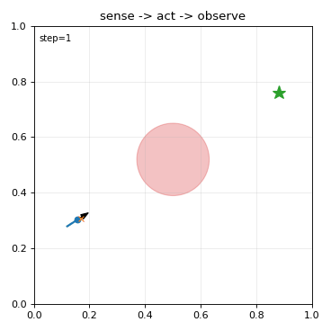 | 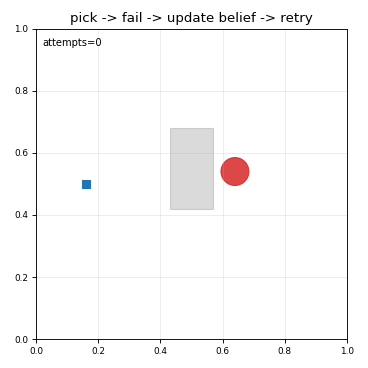 |

### Manipulation

| Reactive grasping | Closed-loop IK |
| --- | --- |
| 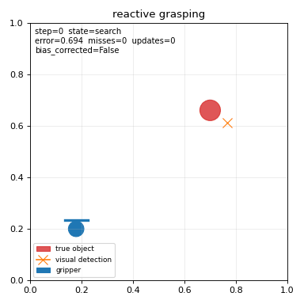 | 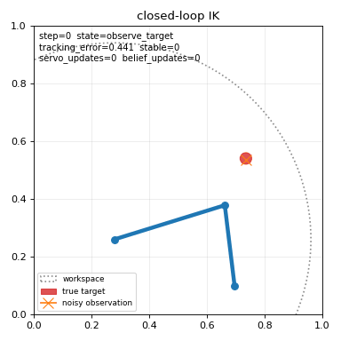 |

| Moving target reaching | Object search and pick |
| --- | --- |
| 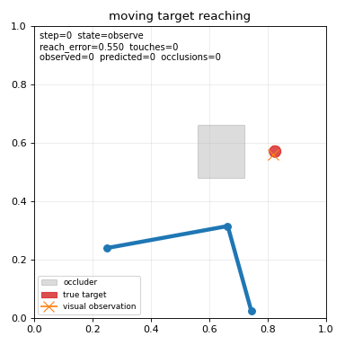 | 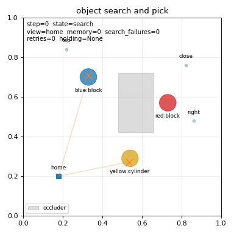 |

| Push then grasp | Probabilistic suction sorting |
| --- | --- |
| 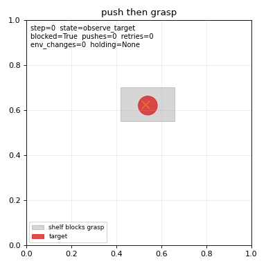 | 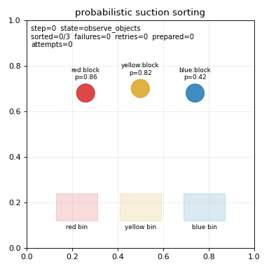 |

| Belief-guided grasp selection | Active viewpoint for grasp |
| --- | --- |
| 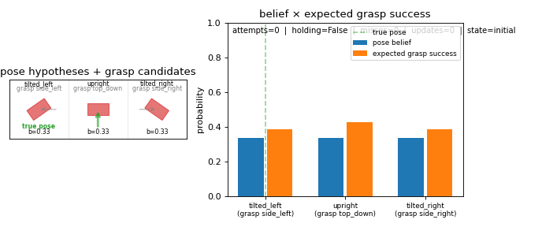 | 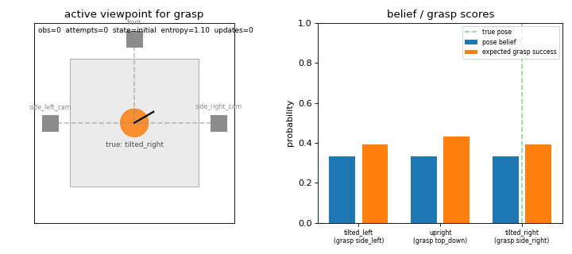 |

| Clear path before pick |
| --- |
| 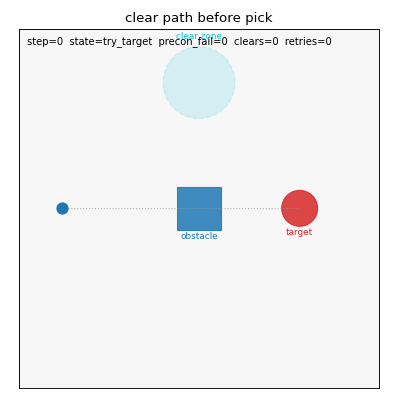 |

### Navigation and recovery

| Reactive obstacle avoidance | Dynamic obstacle avoidance |
| --- | --- |
| 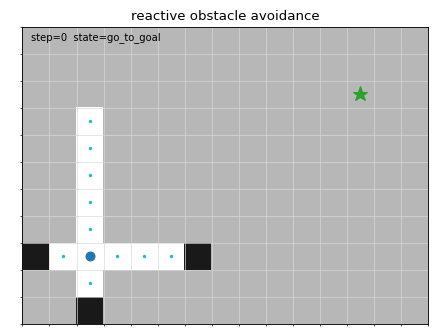 | 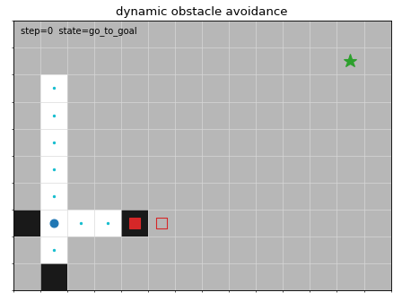 |

| Online A* replanning |
| --- |
| 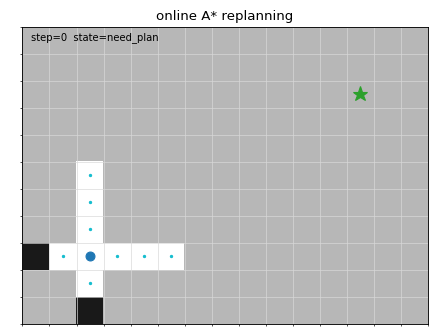 |

| Frontier exploration | Belief-based navigation |
| --- | --- |
| 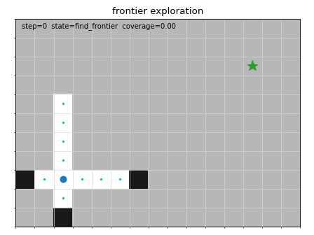 | 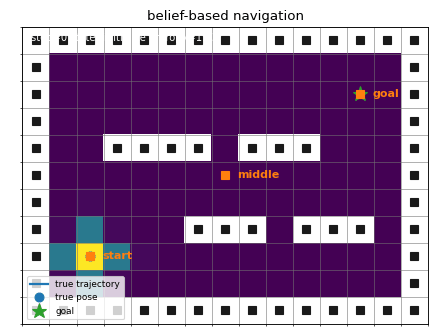 |

| Active SLAM toy | Interactive MPC |
| --- | --- |
| 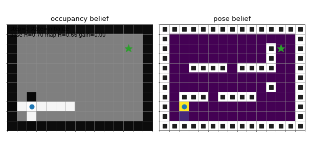 | 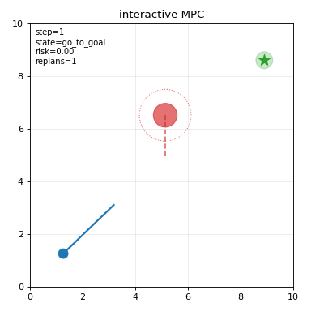 |

| Blocked path recovery | Localization uncertainty recovery |
| --- | --- |
| 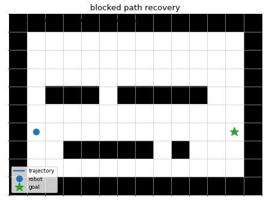 | 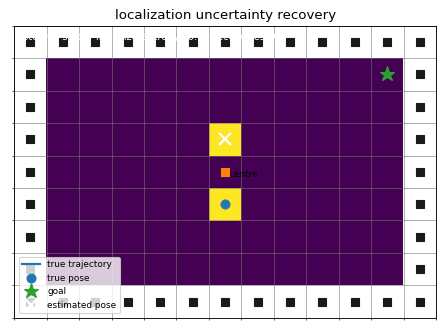 |

| Information-gain navigation | Multi-agent avoidance |
| --- | --- |
| 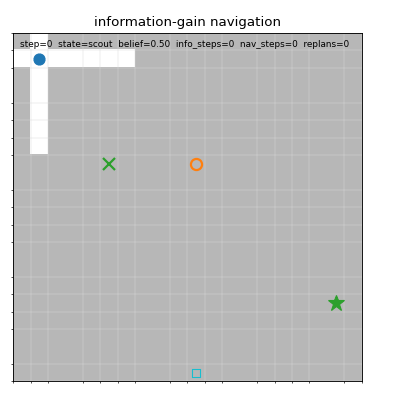 | 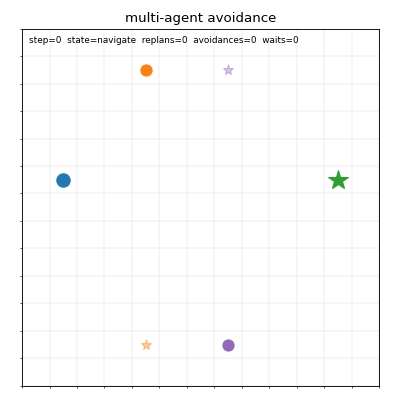 |

| Safety filter (CBF) |
| --- |
| 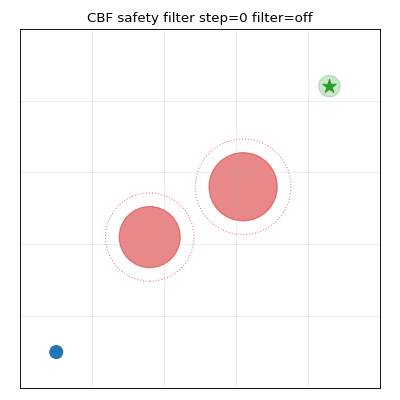 |

### Embodied AI

| Goal command pick | Door search POMDP |
| --- | --- |
| 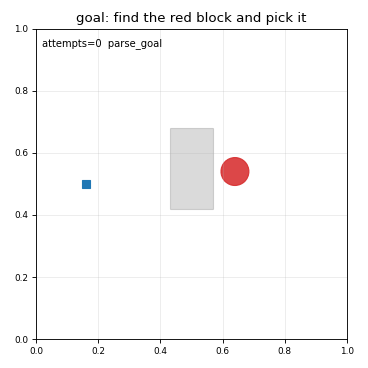 | 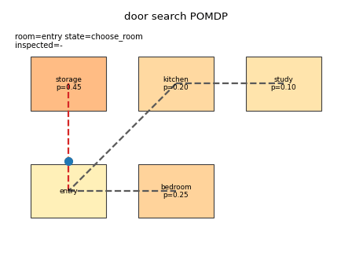 |

| Goal-conditioned minikitchen | Tiny VLA loop |
| --- | --- |
| 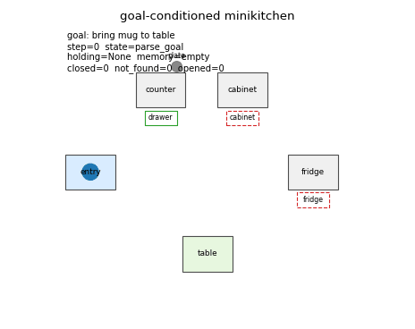 | 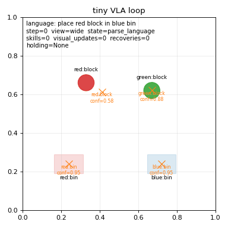 |

| Object permanence toy |
| --- |
| 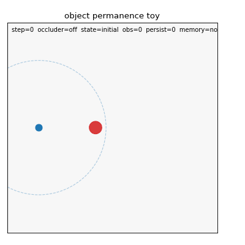 |

| Curiosity grid exploration |
| --- |
| 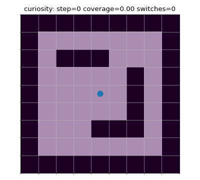 |

### World models

| Tiny world-model planning | Model error recovery |
| --- | --- |
| 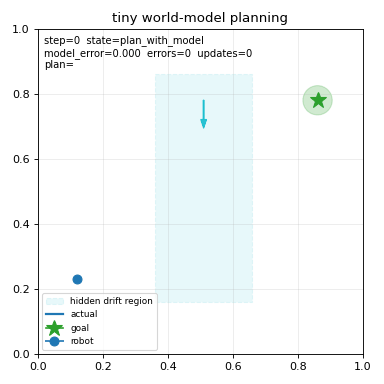 | 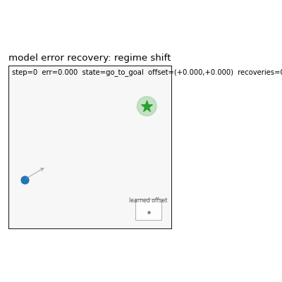 |

Regenerate them with:

```bash
python scripts/make_gifs.py
```

Run the smoke suite and GIF checks with:

```bash
python scripts/run_all_smoke_tests.py --gifs --check-gifs
```

CI runs the same smoke suite and GIF checks on Python 3.10, 3.11, and 3.12.

## Core idea

```python
obs = env.reset(seed=0)
agent.reset()

for t in range(max_steps):
    action = agent.act(obs)
    obs, reward, done, info = env.step(action)
    agent.update(obs, reward, info)
    env.render()

    if done:
        break
```

The goal is not photorealism.
The goal is to understand the perception-action loop.

Every example returns a `Trace`, so headless runs can be inspected without
rendering. See `docs/trace.md` for the full trace contract.

```python
trace = run(seed=0, render=False)
summary = trace.summary()
print(summary.steps, summary.success, summary.failure_counts, summary.counters)
```

## Example categories

- Manipulation
- Navigation
- Active perception
- Failure recovery
- Belief-based decision making
- Embodied AI
- Tiny world models
- Robot runtime loops

## What this is not

This is not a production robotics framework.
This is not a replacement for ROS2, Nav2, MoveIt, MuJoCo, Isaac Sim, or Habitat.
This is a lightweight educational bridge toward them.

Bridge direction is documented separately:

- `docs/plan.md`
- `docs/trace.md`
- `docs/ros2_bridge_strategy.md`
- `docs/simulator_integration_strategy.md`

## Philosophy

Toy world, real concept.

A simplified 2D world is enough to teach:

- partial observability
- online replanning
- active perception
- retry
- collision
- uncertainty
- manipulation failure
- closed-loop intelligence

## Dependency policy

Core dependencies are intentionally small:

- Python >= 3.10
- numpy
- matplotlib

Optional extras are used for everything heavier:

```bash
pip install -e ".[dev]"      # pytest and GIF checks
pip install -e ".[viz]"      # GIF export only
pip install -e ".[pygame]"
pip install -e ".[rl]"
pip install -e ".[mujoco]"
pip install -e ".[pybullet]"
```

ROS2 and simulator integrations are optional bridges, not core dependencies.

`GridWorld2D`, `DynamicObstacleGridWorld`, `BlockedPathWorld`,
`MovingObstacleWorld`, and `Tabletop2D` also have lightweight Gymnasium-style
adapters:

```python
import numpy as np

from pir.adapters import (
    BlockedPathWorldGymnasiumAdapter,
    DynamicObstacleGridWorldGymnasiumAdapter,
    GridWorldGymnasiumAdapter,
    MovingObstacleWorldGymnasiumAdapter,
    Tabletop2DGymnasiumAdapter,
)

env = GridWorldGymnasiumAdapter(seed=0)
obs, info = env.reset(seed=0)
obs, reward, terminated, truncated, info = env.step(1)  # north

dynamic = DynamicObstacleGridWorldGymnasiumAdapter(seed=0)
obs, info = dynamic.reset(seed=0)
obs, reward, terminated, truncated, info = dynamic.step(2)  # east

blocked = BlockedPathWorldGymnasiumAdapter()
obs, info = blocked.reset(seed=0)
obs, reward, terminated, truncated, info = blocked.step(2)  # east

moving = MovingObstacleWorldGymnasiumAdapter(seed=0)
obs, info = moving.reset(seed=0)
obs, reward, terminated, truncated, info = moving.step(
    np.asarray([0.30, 0.10], dtype=np.float32)
)  # continuous velocity

tabletop = Tabletop2DGymnasiumAdapter(seed=0)
obs, info = tabletop.reset(seed=0)
obs, reward, terminated, truncated, info = tabletop.step(
    {"action_type": 0, "target": obs["camera"], "position": obs["detection_position"]}
)
```

Install `pip install -e ".[rl]"` when you want Gymnasium spaces for RL tooling.

## Contributing

See `CONTRIBUTING.md` and `docs/example_authoring.md` before adding examples.
Contributions should keep the loop readable, failure-aware, headless-testable,
and fast to run.

## License

MIT.
