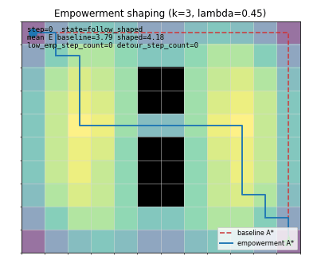

# Embodied AI Examples

## Learning Order

Start with a controlled goal command, then move to hidden-state search,
goal-conditioned kitchen interaction, and the tiny VLA loop.

## What This Teaches

These examples keep language and embodied action small enough to inspect. A
command or hidden-state task becomes a structured goal, then the agent uses
observation, memory, belief, and recoverable failures to decide the next
physical action.

## GIF Gallery

| Goal command pick | Door search POMDP |
| --- | --- |
|  |  |

| Goal-conditioned minikitchen | Tiny VLA loop |
| --- | --- |
|  |  |

| Object permanence toy |
| --- |
|  |

| Curiosity grid exploration | Empowerment navigation |
| --- | --- |
|  |  |

## `01_goal_command_pick.py`

### What this teaches

A simple language goal can be parsed into a structured intent, then executed as
a closed loop with search, memory, belief update, pick failure, and retry.

### Run

```bash
python examples/embodied_ai/01_goal_command_pick.py "find the red block and pick it"
```

### Key loop

```text
parse goal -> search object -> update belief -> pick -> observe failure -> retry
```

### Simplifications

- controlled natural language
- no LLM
- one object
- fake detector
- 2D tabletop
- probabilistic grasp success

### Things to try

- Try an unsupported command and inspect the `unsupported_goal` failure.
- Add a supported command to `SUPPORTED_COMMANDS`.
- Change the search viewpoint order.
- Increase the retry offsets and compare grasp misses.

## `10_door_search_pomdp.py`

### What this teaches

An embodied agent can search under partial observation by remembering visited
rooms, updating a belief over hidden object locations, and recovering from
failed actions such as locked doors or empty containers.

### Run

```bash
python examples/embodied_ai/10_door_search_pomdp.py
```

### Key loop

```text
observe room -> update memory -> choose door/container -> act -> update belief
```

### Simplifications

- small room graph
- one hidden key
- deterministic observations
- fixed search policy
- no LLM
- no full POMDP solver

### Things to try

- Move the hidden key to another container.
- Change the initial `key_belief`.
- Unlock the storage door and compare the search path.
- Add a second empty container to one room.

## `18_goal_conditioned_minikitchen.py`

### What this teaches

A goal-conditioned embodied agent should connect a parsed goal to observation,
memory, object search, container interaction, pick, and place. Failures such as
empty containers and closed containers update the next action.

### Run

```bash
python examples/embodied_ai/18_goal_conditioned_minikitchen.py "bring mug to table"
```

### Key loop

```text
parse goal -> observe station -> search container -> open on failure -> remember object -> pick -> place
```

### Simplifications

- controlled language
- tiny kitchen stations
- deterministic movement
- scripted containers
- no LLM
- no physics

### Things to try

- Change which container holds the target object.
- Add another supported bring goal.
- Start with a cabinet already open.
- Make a container empty and watch memory update.

## `19_tiny_vla_loop.py`

### What this teaches

A VLA-style loop can be understood before any neural model is involved:
language is parsed into a goal, vision produces object tokens, and action is a
discrete skill call. The robot still needs feedback because a low-confidence
visual token can lead to a failed skill.

### Run

```bash
python examples/embodied_ai/19_tiny_vla_loop.py "place red block in blue bin"
```

### Key loop

```text
language goal -> visual tokens -> pick/place skill -> observe failure -> change view -> retry skill
```

### Simplifications

- controlled language
- fake visual tokens
- discrete skills
- one target object and one target bin
- no LLM, VLM, or VLA model

### Things to try

- Lower the visual-token confidence threshold.
- Add a distractor block with a similar color.
- Remove the close-view retry and compare failures.
- Add a new discrete skill and route a goal to it.

## `21_object_permanence_toy.py`

### What this teaches

An embodied agent should not forget an object the moment it leaves the field of
view. The agent sees the object once, an occluder slides over it, and the
observation channel reports the object as gone. The agent persists the last
known position in memory, walks to it, and uses a short-range peek action to
recover the object behind the occluder.

### Run

```bash
python examples/embodied_ai/21_object_permanence_toy.py
```

### Key loop

```text
see object -> store memory -> object goes behind occluder -> persist memory -> walk to remembered position -> peek -> recover
```

### Simplifications

- 1x1 2D table
- one object and one rectangular occluder
- FOV is a fixed-radius circle around the agent
- observation either returns the true position or nothing
- peek is a close-range deterministic check
- no distractor objects

### Things to try

- Set `short_range_radius` above zero and watch the agent see through the
  occluder when very close.
- Move the object after the occluder activates and watch the peek miss.
- Disable memory storage in the agent and watch the agent never reach the
  object.
- Add a second object the agent should ignore.

## `28_curiosity_grid_exploration.py`

### What this teaches

A curiosity-driven agent commits to the most novel reachable cell using a
visit-count map, plans an A* path there, and repeats. This shows a different
exploration signal than frontier exploration (`05_frontier_exploration.py`),
which only cares about the boundary between known and unknown space.
Curiosity instead keeps an intrinsic novelty score even on cells that have
already been observed, so the agent revisits structurally interesting areas.

Success: visited coverage of free cells crosses `coverage_threshold`.
Failure: timeout (terminal) or no reachable novel cell (recoverable).

### Run

```bash
python examples/embodied_ai/28_curiosity_grid_exploration.py
```

### Key loop

```text
update visit count -> compute novelty -> pick most novel reachable cell ->
A* path -> walk until reached or stale -> repeat
```

### Simplifications

- closed grid with a few interior walls
- single agent, no dynamic obstacles
- novelty = 1 / (1 + visit_count) with a small decay each step
- target commitment uses `max_target_age` plus a coverage check
- A* is rebuilt only when the target changes
- coverage threshold is the only termination signal besides timeout

### Things to try

- Lower `coverage_threshold` and watch the loop finish earlier with patchier
  coverage.
- Disable `novelty_decay` (set to 1.0) and watch the agent over-commit to
  the first cell it ever visited.
- Increase `max_target_age` and observe the agent ignoring better targets it
  sees mid-path.
- Replace the score with `novelty - 0.5 * distance` and watch it collapse
  back to nearest-cell behaviour.

## `32_empowerment_navigation.py`

### What this teaches

Empowerment measures how much the agent's actions can influence its
future state. For a deterministic grid with cardinal actions, the
k-step empowerment of a cell `s` is approximated by
`E_k(s) = log2(|reachable_in_k_steps(s)|)`. Open cells have many
successors and high `E_k`; corridor and corner cells have few.

Adding `E_k` as a shaping signal to A*'s edge cost lets the agent
prefer routes that keep options open. The example computes two paths
on the same grid - a baseline Manhattan A* path and an
empowerment-shaped A* path - and lets the robot follow the shaped one.
On a grid where both paths have the same length, the shaped path goes
through the open interior while the baseline hugs the wall.

This is structurally different from `28_curiosity_grid_exploration.py`,
where the intrinsic signal is *experience-dependent* (visit counts
that decay over time). Empowerment is a property of the *world
geometry alone* and can be computed once before the agent ever moves.

Success: robot reaches the goal cell.
Failure: timeout (terminal), no_path (terminal - the goal is
unreachable from the start under the walkable map).

### Run

```bash
python examples/embodied_ai/32_empowerment_navigation.py
```

### Key loop

```text
precompute E_k(s) -> A* baseline cost=1 -> A* shaped cost=1+lambda*(E_max-E_k)
-> follow shaped path -> compare mean E along path
```

### Simplifications

- 12x10 closed grid with a single rectangular wall block
- four cardinal actions, no diagonals
- empowerment is computed exactly by BFS, not estimated by sampling
- the shaping cost is precomputed once at agent construction
- baseline path uses pure Manhattan A* for comparison
- no dynamic obstacles, no agent uncertainty about the map

### Things to try

- Raise `shaping_lambda` from `0.45` to `1.5` and watch the shaped
  path lengthen further to stay in open space.
- Drop `empowerment_horizon` from `3` to `1` and observe the
  empowerment field collapse toward just-counting-neighbors.
- Add a third wall block at row 5 columns 8-10 and see how the field
  redistributes.
- Compare `low_empowerment_step_count` between the shaped and
  baseline paths on a few different grids.
